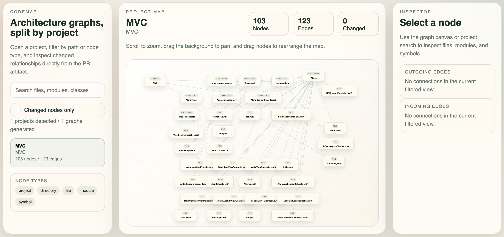

# CodeMap

CodeMap is a multi-language architecture visualizer for pull requests.

It scans a repository, detects bounded projects like `frontend`, `backend`, or an iOS app, and generates interactive dependency maps so developers can understand what connects to what before merging code.

Built with Go, TypeScript, and a lightweight browser-based viewer, CodeMap is designed to run inside GitHub Actions and publish a PR-friendly artifact.

## Demo

[Watch the demo](./docs/demo.mp4)




## What It Does

- Detects separate projects inside a repo from common manifests like `package.json`, `go.mod`, `Package.swift`, `pyproject.toml`, `pom.xml`, and `Cargo.toml`
- Generates one graph per detected project instead of forcing the whole repository into a single unreadable map
- Produces a language-agnostic graph using `project`, `directory`, `file`, `module`, and `symbol` nodes
- Adds shallow relationship edges such as `contains`, `depends_on`, and cross-project links
- Highlights PR-touched files so reviewers can inspect the changed neighborhood first
- Ships an interactive viewer with pan, zoom, drag, selection, and inspector panels

## Why This Exists

Large repositories hide architecture drift.

Developers often merge code without seeing:

- what module is now depending on what
- whether a frontend is reaching into backend internals
- whether a new change crosses a boundary it should not
- how a single PR changes the dependency shape of a project

CodeMap makes those relationships visible directly in the PR workflow.

## Quick Start

From the CodeMap repo root:

```bash
go run ./cmd/codemap analyze --repo . --out ./codemap-out
```

For another repository, point `--repo` at that project:

```bash
go run ./cmd/codemap analyze --repo /path/to/your/repo --out ./codemap-out
```

If `--repo` is an absolute path and `--out` is relative, the output is written inside the scanned repo.

Open the generated viewer:

- `codemap-out/viewer/index.html`

## CLI

```bash
go run ./cmd/codemap analyze --repo . --out ./codemap-out
```

Important flags:

- `--include` limits analysis to comma-separated path prefixes
- `--exclude` skips comma-separated path prefixes
- `--config` points to a JSON file with `projectRoots` overrides
- `--changed-files` accepts a comma-separated list of repo-relative paths
- `--max-files` limits file count per project to keep CI safe

Generated output:

- `manifest.json`
- `graphs/<project-id>.json`
- `viewer/index.html`
- `summary.json`
- `summary.md`

## Viewer

The generated viewer is offline-friendly and artifact-friendly.

It currently supports:

- multiple project graphs
- pan and zoom
- dragging nodes
- selecting nodes
- highlighting connected nodes and lines
- inspector details for the selected node
- changed-node filtering

The checked-in `web/src` folder mirrors the viewer direction in TypeScript for future iteration. The emitted viewer bundle used by the CLI is embedded by the Go binary so GitHub Actions can produce a self-contained artifact without an additional frontend build step.

## GitHub Actions

Use the composite action from this repo:

```yaml
- uses: ./
  with:
    output-dir: codemap-out
```

The action:

- detects changed files in pull requests
- runs the Go analyzer
- uploads the generated artifact
- posts or updates a PR comment with the summary

## Current Scope

CodeMap is intentionally broad-first for v1:

- support many languages with graceful degradation
- prioritize useful dependency maps over deep semantic perfection
- keep the output PR-friendly and easy to open

That means some languages currently get shallower graphs than others, but the architecture map is still useful for spotting project boundaries and dependency drift.

## Roadmap

- Replace the heuristic parser with deeper Tree-sitter-backed parsers per language
- Add richer reference and call edges
- Add architecture rules and optional CI enforcement
- Improve layout and graph navigation for large repos
- Persist custom node positions in the viewer
